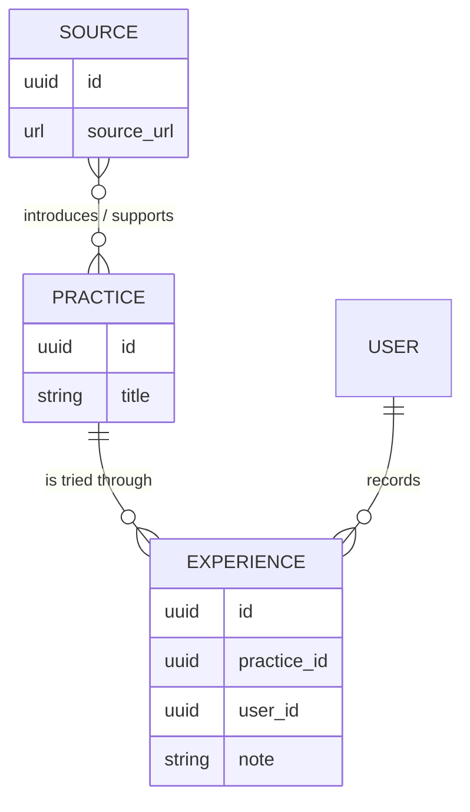
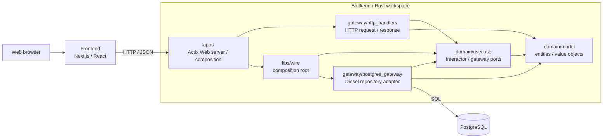

# Tameshare

Tameshareは、SNS・Web記事・動画などで見つけた「あとで試してみたい」を、情報源そのものではなく、**実際に試せる方法**を中心に整理するWebサービスです。

一般的なブックマークでは、試したい方法がニュースや資料などの別の情報と混在し、元の媒体ごとに散らばります。Tameshareは「何を試すのか」「どこで知ったのか」「試してどうだったのか」を分けて構造化し、媒体をまたいで実践と体験を蓄積できるようにします。

## コンセプト

Tameshareでは、情報を次の3つの概念で扱います。

- **Source** — Practiceの根拠・出典となるWeb記事、動画、SNS投稿などの情報源
- **Practice** — 情報源から得られる、短時間で実際に試せる方法
- **Experience** — ユーザーがPracticeを試した体験。任意の短い補足を添えられる

中心となるのはSourceではなくPracticeです。1つのSourceから複数のPracticeが得られる一方、同じPracticeを複数のSourceが紹介・裏付けることもあるため、SourceとPracticeは多対多（N:M）で関連します。Experienceは、試したユーザーとPracticeを結びます。

## アーキテクチャ

リポジトリはNext.jsのFrontend、RustのBackend、PostgreSQLで構成されています。BackendはClean Architectureの依存方向を採用し、DomainをHTTPフレームワークやデータベースの詳細から分離しています。

### Backendの責務と依存関係

| パス | 責務 |
| --- | --- |
| [`backend/domain/model/`](backend/domain/model/) | Source、Practice、ExperienceなどのEntity・Value Objectと不変条件 |
| [`backend/domain/usecase/`](backend/domain/usecase/) | ユースケースを調整するInteractorと、外部処理に対するCommand / Query Gateway port |
| [`backend/gateway/http_handlers/`](backend/gateway/http_handlers/) | Actix WebのHTTP入出力をUseCaseの型へ変換するPresentation adapter |
| [`backend/gateway/postgres_gateway/`](backend/gateway/postgres_gateway/) | Gateway portをDieselとPostgreSQLで実装するPersistence adapter |
| [`backend/libs/wire/`](backend/libs/src/wire/) | PostgreSQL GatewayをInteractorへ注入するComposition Root |
| [`backend/apps/`](backend/apps/) | HTTPサーバーの起動、ルート・Middleware・依存関係の組み立て |
| [`backend/migrations/`](backend/migrations/) | PostgreSQL schemaを管理するDiesel migration |

依存関係の中心は`domain/model`です。`domain/usecase`はModelに依存してGatewayの抽象を定義し、HTTPとPostgreSQLの各Gatewayがその境界へ依存します。実装の選択と注入は外側の`libs/wire`と`apps`が担います。

FrontendはNext.js App RouterのページとServer Componentsを基盤とし、データアクセスをRepository interfaceの背後に分離しています。これにより、画面はデータ取得元の詳細ではなくFrontend側の型とRepository契約に依存します。

## 技術スタック

| 領域 | 主な技術 |
| --- | --- |
| Frontend | TypeScript、Next.js 15（App Router）、React 19、Biome |
| Backend | Rust 2024 Edition、Actix Web、async-trait |
| Persistence | PostgreSQL、Diesel、diesel-async、Diesel migrations |
| Domain / serialization | UUID v7、Chrono、Serde |
| Local infrastructure | Docker Compose |

BackendはCargo workspaceとして、レイヤーやadapterごとにcrateを分割しています。FrontendとBackendは同じリポジトリで管理しつつ、それぞれ独立したビルド構成を持ちます。

## ドキュメント

READMEはコンセプトと全体構造の入口に限定しています。現在の振る舞いは実装とテストを正とし、背景、要件、設計判断は以下の資料を参照してください。

- [サービスコンセプト・MVP方針](docs/requirements/サービスコンセプト・MVP方針.md)
- [ドメインモデル・制約](docs/requirements/ドメインモデル・制約.md)
- [コーディング・設計ルール](docs/development/coding_rules.md)
- [Backend実装方針](docs/Backend実装方針・Codex指示書.md)
- [OpenAPI定義](backend/docs/openapi/tameshare.openapi.yaml)
- [Backendのローカル開発・テスト手順](backend/README.md)
- [Frontendの開発手順](frontend/README.md)
- [ローカル起動・運用・公開確認手順](docs/operations/local-and-release.md)

## ローカルで起動する

Docker、direnv、Rust/Cargo、Node.js 24、npmを用意して、リポジトリルートで `make setup` を実行します。`backend/.envrc` の `ANONYMOUS_AUTH_SECRET` に32バイト以上のランダムな値を設定し、`direnv allow backend` を再実行してください。次に `make up`、`make seed` を実行します。別ターミナルで `make backend-run` と `make frontend-run` を維持し、`http://localhost:3000/practices` を開きます。詳細は上記の運用手順にあります。
